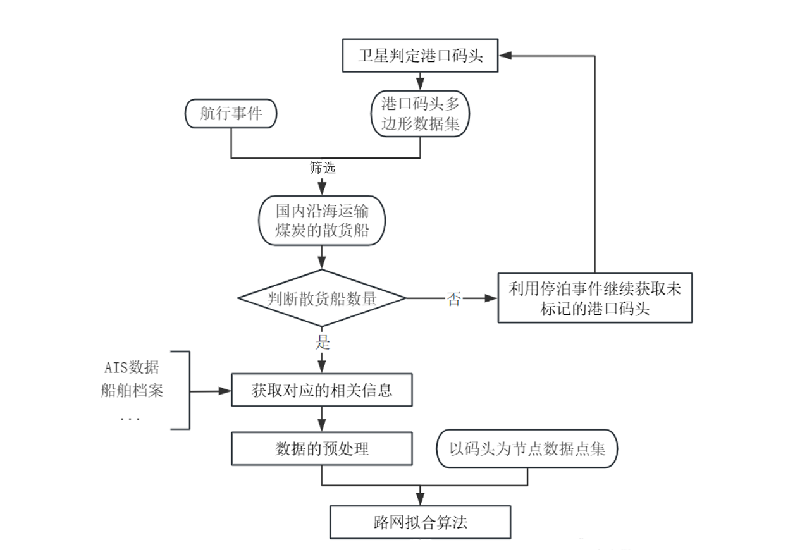

# SISI

## 1 Overview

### 1.1 Transportation Network
This project focuses on:
- Generate coal docks in China.
- Generate coal ships' mmsi list.
- Analyze docks transportation indicators including average and transportation capability, transprotation duration to different docks, shipowner analysis and etc.
- Clustered route among docks.

The analysis is conducted using Python, leveraging libraries such as Pandas, NumPy, MySQL and etc for efficient data manipulation, and Matplotlib or Poltly for visualization.

## 2. Now Working on:

### 2.1 TODO List

- [x] Database initialization
- [x] Uploading data
- [ ] Parsing kml files from Google Earth Pro
- [x] Matching events with polygons script
- [ ] DBSCAN un-matched events
- [x] OD pairs Calculation script

### 2.2 Flow Details
Make a delievery srcipt, including:
1. polygons start from a specifc port or province, which contains a large amount of one particular type of ship
2. based on the polygons from step 1, find the ships which has berthed in those polygons.
3. based on the ships from step 2, find where these ships has berthed and then extend the polygons set.
4. now, we have updated polygons set. based on the latest polygon set, find more ships and marked them as particular type, and then we have updated ships set.
5. looping step 1 to step 4 back and forth till there is no more polygons come up.

infrastructural data:
1. global or regional ships events log
2. ais ships statical data
